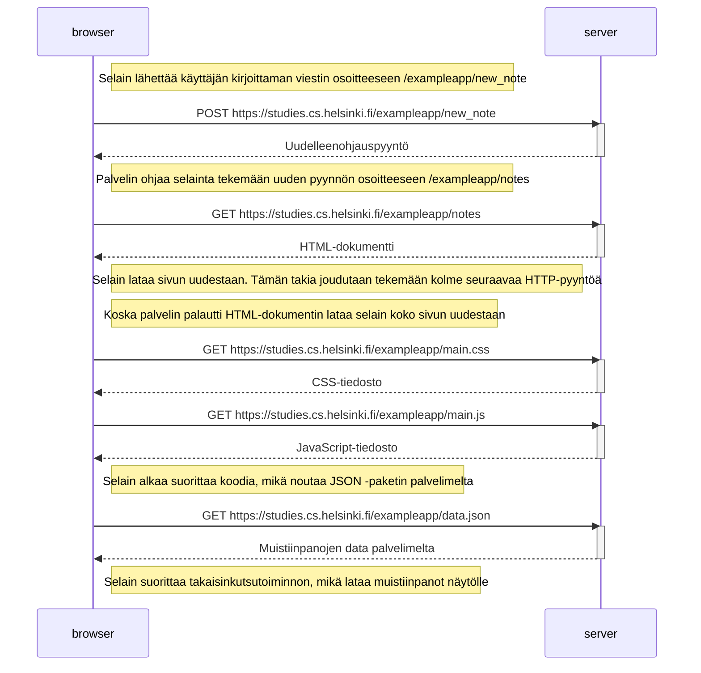

```mermaid

sequenceDiagram
    participant browser
    participant server
    
    Note right of browser: Selain lähettää käyttäjän kirjoittaman viestin osoitteeseen /exampleapp/new_note

    browser->>server: POST https://studies.cs.helsinki.fi/exampleapp/new_note
    activate server
    server-->>browser: Uudelleenohjauspyyntö
    deactivate server

    Note right of browser: Palvelin ohjaa selainta tekemään uuden pyynnön osoitteeseen /exampleapp/notes
    
    browser->>server: GET https://studies.cs.helsinki.fi/exampleapp/notes
    activate server
    server-->>browser: HTML-dokumentti
    deactivate server

    Note right of browser: Selain lataa sivun uudestaan. Tämän takia joudutaan tekemään kolme seuraavaa HTTP-pyyntöä
    Note right of browser: Koska palvelin palautti HTML-dokumentin lataa selain koko sivun uudestaan
    
    browser->>server: GET https://studies.cs.helsinki.fi/exampleapp/main.css
    activate server
    server-->>browser: CSS-tiedosto
    deactivate server
    
    

    browser->>server: GET https://studies.cs.helsinki.fi/exampleapp/main.js
    activate server
    server-->>browser: JavaScript-tiedosto
    deactivate server     

    Note right of browser: Selain alkaa suorittaa koodia, mikä noutaa JSON -paketin palvelimelta 

    browser->>server: GET https://studies.cs.helsinki.fi/exampleapp/data.json
    activate server
    server-->>browser: Muistiinpanojen data palvelimelta
    deactivate server    

    Note right of browser: Selain suorittaa takaisinkutsutoiminnon, mikä lataa muistiinpanot näytölle

```