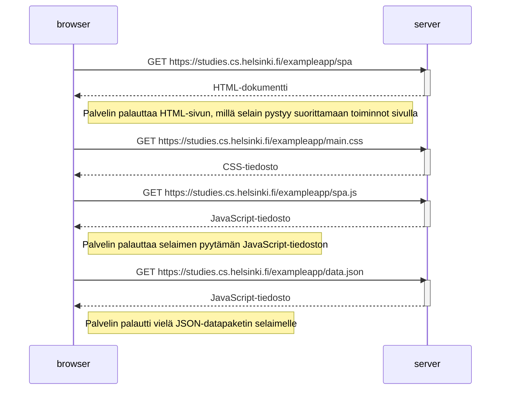

```mermaid

sequenceDiagram
    participant browser
    participant server
    
    browser->>server: GET https://studies.cs.helsinki.fi/exampleapp/spa
    activate server
    server-->>browser: HTML-dokumentti
    deactivate server

    Note right of browser: Palvelin palauttaa HTML-sivun, millä selain pystyy suorittamaan toiminnot sivulla
    
    browser->>server: GET https://studies.cs.helsinki.fi/exampleapp/main.css
    activate server
    server-->>browser: CSS-tiedosto
    deactivate server
    
    browser->>server: GET https://studies.cs.helsinki.fi/exampleapp/spa.js
    activate server
    server-->>browser: JavaScript-tiedosto
    deactivate server

    Note right of browser: Palvelin palauttaa selaimen pyytämän JavaScript-tiedoston

    browser->>server: GET https://studies.cs.helsinki.fi/exampleapp/data.json
    activate server
    server-->>browser: JavaScript-tiedosto
    deactivate server     

    Note right of browser: Palvelin palautti vielä JSON-datapaketin selaimelle 
```