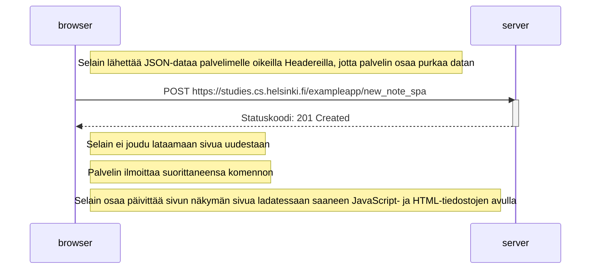

```mermaid

sequenceDiagram
    participant browser
    participant server

    Note right of browser: Selain lähettää JSON-dataa palvelimelle oikeilla Headereilla, jotta palvelin osaa purkaa datan
    
    browser->>server: POST https://studies.cs.helsinki.fi/exampleapp/new_note_spa
    activate server
    server-->>browser: Statuskoodi: 201 Created
    deactivate server

    Note right of browser: Selain ei joudu lataamaan sivua uudestaan
    Note right of browser: Palvelin ilmoittaa suorittaneensa komennon 
    Note right of browser: Selain osaa päivittää sivun näkymän sivua ladatessaan saaneen JavaScript- ja HTML-tiedostojen avulla
```